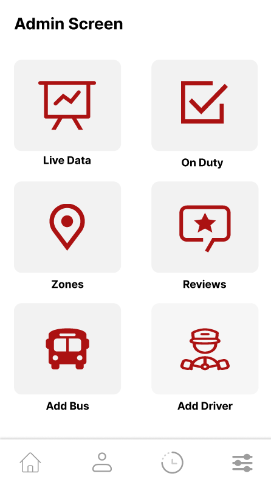
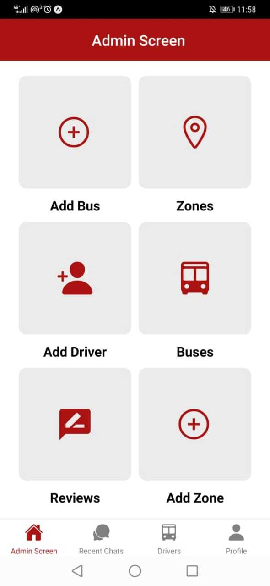
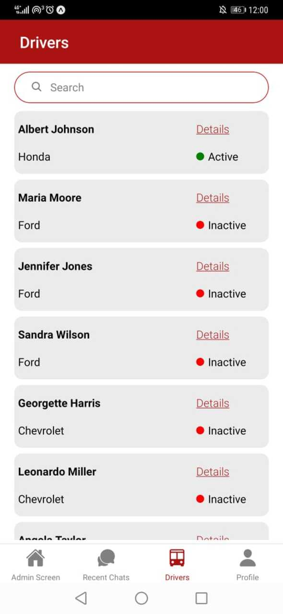

<br><br>

<!-- project philosophy -->


> B-Route is more than just an app; it's a new way to improve your bus commute. We focus on giving you real-time info about bus locations, routes, and available seats
>
> B-Route is designed with you in mind – simple, clear, and easy to use. From opening the app to reaching your destination, we want to make your journey hassle-free.We optimize bus resources, reducing congestion and making public transport more sustainable.

### User Stories

### Passenger User Stories

- As a passenger, I want to view the real-time locations of the buses on the map.

- As a passenger, I want to see the availability of seats on the bus in real-time.

- As a passenger, I want to scan the barcode of the driver to start and end a ride.

### Driver User Stories

- As a driver, I want to log in to start my shift.

- As a driver, I want to show my barcode to to get scanned by user and update my location.

- As a driver, I want to chat with admin in case of any problem I face.

### Admin User Stories

- As an admin, I want to monitor the active drivers.

- As an admin, I want to chat with drivers and passengers for support.

- As an admin, I want to view and analyze passenger ratings and feedback for each journey to assess overall service quality.

  <br><br>

<!-- Tech stack -->


### B-ROUTE is built using the following technologies:

- This project uses the [React Native Expo development framework](https://reactnative.dev/). React Native is a cross-platform hybrid app development platform which allows us to use a single codebase for apps on mobile.
- For persistent storage (database), the app utilizes the [MySQL database](https://www.mysql.com/), enabling the creation of a custom storage schema and saving data to a local MySQL database.
- For chat system, the app uses the [Firebase Real-Time Database](https://firebase.google.com/docs/database) package which supports Android, iOS.
  - For location tracking, the app uses [Expo Location Library](https://docs.expo.dev/versions/latest/sdk/location/) which supports Android, iOS.
- For tracking seats, the app uses [ESP8266 Module](https://www.espressif.com/en/products/socs/esp8266), which send uses [HTTPClient](https://www.arduino.cc/reference/en/libraries/httpclient/) to send requests yo update the current state of seats.

  <br><br>

<!-- UI UX -->


> Using the mockups as a guide, we implemented the B-ROUTE app with the following features:

- Project Figma design [figma](https://www.figma.com/file/GJ2YyJatUqoTfFIRbqcMKn/B-route?type=design&node-id=123%3A450&mode=design&t=PvP4zBXw9OVG0g8b-1)

### Mockups

| Landing screen                   | Sign Up Screen                | Administration Screen                |
| -------------------------------- | ----------------------------- | ------------------------------------ |
|  |  |  |

<br><br>

<!-- Database Design -->


### Architecting Data Excellence: Innovative Database Design Strategies:

- Insert ER Diagram here

<br><br>

<!-- Implementation -->


### User Screens (Mobile)

| Home screen map                  | Bus details screen                | Seats track screen             |
| -------------------------------- | --------------------------------- | ------------------------------ |
|  |  |  |

### Driver Screens (Mobile)

| Driver barcode screen             | Bus details screen                | Profile screen                  |
| --------------------------------- | --------------------------------- | ------------------------------- |
|  |  |  |

### Admin Screens

| Admin screen                     | Chat screen                 | Active users screen             |
| -------------------------------- | --------------------------- | ------------------------------- |
|  |  |  |

<br><br>

<!-- AWS Deployment -->


### Efficient AI Deployment: Unleashing the Potential with AWS Integration:

- This project leverages AWS deployment strategies to seamlessly integrate and deploy natural language processing models. With a focus on scalability, reliability, and performance, we ensure that AI applications powered by these models deliver robust and responsive solutions for diverse use cases.

<br><br>

<!-- Unit Testing -->


### Precision in Development: Harnessing the Power of Unit Testing:

- This project employs rigorous unit testing methodologies to ensure the reliability and accuracy of code components. By systematically evaluating individual units of the software, we guarantee a robust foundation, identifying and addressing potential issues early in the development process.

<br><br>

<!-- How to run -->


> To set up B-ROUTE locally, follow these steps:

### Prerequisites

This is an example of how to list things you need to use the software and how to install them.

- npm
  ```sh
  npm install npm@latest -g
  ```

## Installation

## Frontend (React Native)

```sh
git clone https://github.com/zeinshhadi/b-route-app.git
```

### Navigate to the frontend directory

```sh
cd frontend
```

### Install NPM packages

```sh
 npm install npm@latest -g
```

## Backend (Laravel)

### Navigate to the backend directory

```sh
cd backend
```

## Install Composer dependencies

```sh
composer install
```

## Install Composer dependencies

```sh
composer install
```

## Generate the application key

```sh
php artisan key:generate
```

## Download Laravel dependencies

```sh
php artisan migrate
```

```sh
php artisan db:seed DatabaseSeeder
```

Now, you should be able to run B-ROUTE locally and explore its features.
