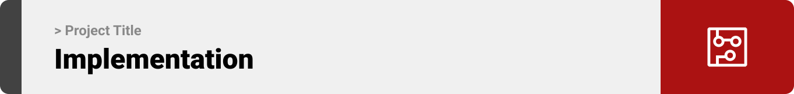

<br><br>

<!-- project philosophy -->


> B-Route is more than just an app; it's a new way to improve your bus commute. We focus on giving you real-time info about bus locations, routes, and available seats
>
> B-Route is designed with you in mind – simple, clear, and easy to use. From opening the app to reaching your destination, we want to make your journey hassle-free.We optimize bus resources, reducing congestion and making public transport more sustainable.

### User Stories

### Passenger User Stories

- As a passenger, I want to view the real-time locations of the buses on the map.

- As a passenger, I want to see the availability of seats on the bus in real-time.

- As a passenger, I want to scan the barcode of the driver to start and end a ride.

### Driver User Stories

- As a driver, I want to log in to start my shift.

- As a driver, I want to show my barcode to to get scanned by user and update my location.

- As a driver, I want to chat with admin in case of any problem I face.

### Admin User Stories

- As an admin, I want to monitor the active drivers.

- As an admin, I want to chat with drivers and passengers for support.

- As an admin, I want to view and analyze passenger ratings and feedback for each journey to assess overall service quality.

  <br><br>

<!-- Prototyping -->


> We made B-route by drawing and testing ideas until we got a design that's simple to use. It helps you track buses, check seats, and chat easily between admins, drivers, and passengers.

### MockUps

| Login screen                            | Register screen                       | Landing screen                        |
| --------------------------------------- | ------------------------------------- | ------------------------------------- |
|  |  |  |

| Home screen                             | Menu Screen                           | Order Screen                          |
| --------------------------------------- | ------------------------------------- | ------------------------------------- |
|  |  |  |

<br><br>

<!-- Implementation -->


> Using the wireframes and mockups as a guide, we implemented the B-ROUTE app with the following features:

### User Screens (Mobile)

| Login screen                              | Register screen                         | Landing screen                          | Loading screen                          |
| ----------------------------------------- | --------------------------------------- | --------------------------------------- | --------------------------------------- |
|  |  |  |  |
| Home screen                               | Menu Screen                             | Order Screen                            | Checkout Screen                         |
|  |  |  |  |

### Admin Screens (Web)

| Login screen                            | Register screen                       | Landing screen                        |
| --------------------------------------- | ------------------------------------- | ------------------------------------- |
|  |  |  |
| Home screen                             | Menu Screen                           | Order Screen                          |
|  |  |  |

<br><br>

<!-- Tech stack -->


### B-ROUTE is built using the following technologies:

- This project uses the [React Native Expo development framework](https://reactnative.dev/). React Native is a cross-platform hybrid app development platform which allows us to use a single codebase for apps on mobile.
- For persistent storage (database), the app utilizes the [MySQL database](https://www.mysql.com/), enabling the creation of a custom storage schema and saving data to a local MySQL database.
- For chat system, the app uses the [Firebase Real-Time Database](https://firebase.google.com/docs/database) package which supports Android, iOS.
  - For location tracking, the app uses [Expo Location Library](https://docs.expo.dev/versions/latest/sdk/location/) which supports Android, iOS.
- For tracking seats, the app uses [ESP8266 Module](https://www.espressif.com/en/products/socs/esp8266), which send uses [HTTPClient](https://www.arduino.cc/reference/en/libraries/httpclient/) to send requests yo update the current state of seats.
- This project is hosted on [AWS](https://aws.amazon.com/websites/).
  <br><br>

<!-- How to run -->


> To set up B-ROUTE locally, follow these steps:

### Prerequisites

This is an example of how to list things you need to use the software and how to install them.

- npm
  ```sh
  npm install npm@latest -g
  ```

## Installation

## Frontend (React Native)

```sh
git clone https://github.com/zeinshhadi/b-route-app.git
```

### Navigate to the frontend directory

```sh
cd frontend
```

### Install NPM packages

```sh
 npm install npm@latest -g
```

## Backend (Laravel)

### Navigate to the backend directory

```sh
cd backend
```

## Install Composer dependencies

```sh
composer install
```

## Install Composer dependencies

```sh
composer install
```

## Generate the application key

```sh
php artisan key:generate
```

## Download Laravel dependencies

```sh
php artisan migrate
```

```sh
php artisan db:seed DatabaseSeeder
```

Now, you should be able to run B-ROUTE locally and explore its features.
