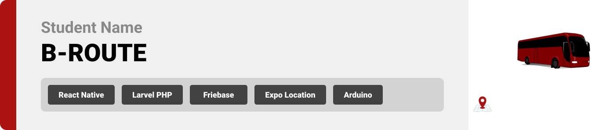

<br><br>

<!-- project philosophy -->


> B-Route is more than just an app; it's a new way to improve your bus commute. We focus on giving you real-time info about bus locations, routes, and available seats
>
> B-Route is designed with you in mind – simple, clear, and easy to use. From opening the app to reaching your destination, we want to make your journey hassle-free.We optimize bus resources, reducing congestion and making public transport more sustainable.

### User Stories

### Passenger User Stories

- As a passenger, I want to view the real-time locations of the buses on the map, so that I can check which bus should I take to my next stop,

- As a passenger, I want to see the availability of seats on the bus in real-time, so that I can know if the closet bus has any seats available.

- As a passenger, I want to scan the barcode of the driver to start and end a ride, so that I can reach my destination and add a feedback.

### Driver User Stories

- As a driver, I want to log in to start my shift, so that I can appear as active to the administration.

- As a driver, I want to show my barcode to to get scanned by user and update my location, so that user can have a seat in my bus where and to get his feedback when he arrives to his destination.

- As a driver, I want to chat with admin in case of any problem I face, so that in I can notice the administration or get noticed of any issue or important info.

### Admin User Stories

- As an admin, I want to monitor the active drivers, so that he can keep track of active drivers and on which zones we have a bus working at the time being.

- As an admin, I want to chat with drivers and passengers for support, so that in case of any positive or negative back, or in case of any problem we got noticed.

- As an admin, I want to view and analyze passenger ratings and feedback for each journey to assess overall service quality, so that we can improve the service we are offering to our users.

  <br><br>

<!-- Tech stack -->


### B-ROUTE is built using the following technologies:

- This project uses the [React Native Expo development framework](https://reactnative.dev/). React Native is a cross-platform hybrid app development platform which allows us to use a single codebase for apps on mobile.
- For persistent storage (database), the app utilizes the [MySQL database](https://www.mysql.com/), enabling the creation of a custom storage schema and saving data to a local MySQL database.
- For server-side operations, this project leverages Laravel, a PHP framework known for its implementation of the MVC (Model-View-Controller) architectural design pattern.
- For backend ap
- For chat system, the app uses the [Firebase Real-Time Database](https://firebase.google.com/docs/database) package which supports Android, iOS.
- For location tracking, the app uses [Expo Location Library](https://docs.expo.dev/versions/latest/sdk/location/) which supports Android, iOS.
- For tracking seats, the app uses [ESP8266 Module](https://www.espressif.com/en/products/socs/esp8266), which uses [HTTPClient](https://www.arduino.cc/reference/en/libraries/httpclient/) to send requests yo update the current state of seats.

  <br><br>

<!-- UI UX -->


> Using the mockups as a guide, we implemented the B-ROUTE app with the following features:

- Project Figma design [figma](https://www.figma.com/file/GJ2YyJatUqoTfFIRbqcMKn/B-route?type=design&node-id=123%3A450&mode=design&t=PvP4zBXw9OVG0g8b-1)

### Mockups

| Landing screen                   | Sign Up Screen                | Administration Screen                 |
| -------------------------------- | ----------------------------- | ------------------------------------- |
|  |  |  |

<br><br>

<!-- Database Design -->


### Database Design :


<br><br>

<!-- Implementation -->


### User Screens (Mobile)

| Home screen map                  | Bus details screen                | Seats track screen             |
| -------------------------------- | --------------------------------- | ------------------------------ |
|  |  |  |

### Driver Screens (Mobile)

| Driver barcode screen             | Drivers displayed screen          | Profile screen                  |
| --------------------------------- | --------------------------------- | ------------------------------- |
|  |  |  |

### Admin Screens

| Admin screen                           | Chat screen                 | Active users screen                      |
| -------------------------------------- | --------------------------- | ---------------------------------------- |
|  |  |  |

<br><br>

<!-- AWS Deployment -->


## AWS Integration:

- This project is deployed to Amazon Linux 2023 backend, by using the following steps :

1. Update Amazon Linux 2023 Packages
2. Install LAMP Stack
3. Start and enable the Apache and MariaDB services
4. Create Database
5. Install PHP Composer for Laravel on on Linux 2023
6. Download the Laravel framework project
7. Install Laravel on Amazon Linux 2023
8. Create the Laravel environment configuration file
9. Apache Configuration for PHP Laravel App
10. Get the Laravel demo page

Here are the AWS deployment commands I used to deploy my Laravel server:

1.  Update Amazon Linux 2023 Packages:

```sh
  sudo dnf update
```

2.  Install LAMP Stack (Linux, Apache, MySQL, PHP):

```sh
    sudo dnf install httpd mariadb\*-server php php-mysqlnd
```

3.  Start and Enable the Apache and MariaDB Services:

```sh
    sudo systemctl enable --now httpd
    sudo systemctl enable --now mariadb
```

4.  LogIn to MySWL and CREATE Database:

```sh
  sudo mysql
  CREATE DATABASE yourdb;
  CREATE USER 'youruser'@'localhost' IDENTIFIED BY 'password';
  GRANT ALL ON yourdb.\* to 'youruser'@'localhost';
  FLUSH PRIVILEGES;
  quit;
```

5.  Install PHP Composer for Laravel on Amazon Linux 2023:

```sh
    curl -sS https://getcomposer.org/installer | php
    sudo mv composer.phar /usr/local/bin/composer
    sudo chmod +x /usr/local/bin/composer
```

6.  Clone the Laravel Project:

```sh
  cd /var/www
  sudo dnf install git -y
  sudo git clone RepoLink
```

7.  Give Permission to Your Current to Access the Laravel Folder:

```sh
    cd /var/www/RepoNameLaravel
    sudo chown -R $USER /var/www/laravel
```

8.  Install Laravel on Amazon Linux 2023:

```sh
    composer install
    sudo chown -R apache.apache /var/www/laravel
    sudo chmod -R 755 /var/www/laravel
    sudo chmod -R 777 /var/www/laravel/storage
```

9.  Create the Laravel Environment Configuration File:

```sh
  sudo cp .env.example .env
  sudo php artisan key:generate
  sudo nano .env
```

10. Go to the Database Section and Change the Values:

```sh
  Database Name
  Database Username
  Database Password
  Save the file using Ctrl+O, hit the Enter key, and then exit the file using Ctrl+X.
```

11. Apache Configuration for PHP Laravel App:

```sh
    sudo nano /etc/httpd/conf.d/laravel.conf
```

12. Add the Following Lines:

```sh
  <VirtualHost \*:80>
  ServerName laravel.example.com
  DocumentRoot /var/www/laravel/public

      <Directory /var/www/laravel>
             AllowOverride All
      </Directory>

    </VirtualHost>
```

13. Restart the Apache:

```sh

    sudo systemctl restart httpd
```

14. Get Access to Your IP:

```sh
  curl ipinfo.io
```

    <br><br>

<!-- Unit Testing -->


### Testing Screenshot:

- I used some tests to test my apis functionalities, where all my tests succeeded and work as it should. Below you can find a screenshot of there tests.


<br><br>

<!-- How to run -->


> To set up B-ROUTE locally, follow these steps:

### Prerequisites

This is an example of how to list things you need to use the software and how to install them.

- npm
  ```sh
  npm install npm@latest -g
  ```

## Installation

## Frontend (React Native)

```sh
git clone https://github.com/zeinshhadi/b-route-app.git
```

### Navigate to the frontend directory

```sh
cd frontend
```

### Install NPM packages

```sh
 npm install npm@latest -g
```

## Backend (Laravel)

### Navigate to the backend directory

```sh
cd backend
```

## Install Composer dependencies

```sh
composer install
```

## Install Composer dependencies

```sh
composer install
```

## Generate the application key

```sh
php artisan key:generate
```

## Download Laravel dependencies

```sh
php artisan migrate
```

```sh
php artisan db:seed DatabaseSeeder
```

Now, you should be able to run B-ROUTE locally and explore its features.
